# 🏢 Awesome Digital Twin For Buildings 🚀

  

  
  
  
  
  

## 🌟 Overview & Market Intelligence

A curated directory of **Building Digital Twin SaaS Platforms**, **Open-Source Building Information Modeling (BIM/IFC)** engines, **Smart Building Operations**, **IoT Sensor Fusion**, and **PropTech Architectures**.

These systems create living, real-time virtual models of physical facility assets—integrating 3D geometry, HVAC sensor streams, operational analytics, and spatial intelligence to enable energy efficiency, predictive maintenance, and sustainable building management.

---

## 📑 Table of Contents

- [🏢 SaaS & Hosted Commercial Platforms](#-saas--hosted-commercial-platforms)
- [🔓 Open-Source GitHub Projects](#-open-source-github-projects)
- [🛠️ Architectural Blueprints](#%EF%B8%8F-architectural-blueprints)
- [🤝 How to Contribute](#-how-to-contribute)
- [💖 Support & Sponsorship](#-support--sponsorship)
- [⚠️ Disclaimer](#%EF%B8%8F-disclaimer)
- [📈 Star History](#-star-history)

---

## 🏢 SaaS & Hosted Commercial Platforms

> 📊 **Market Size & Market Structure**: The global Building Digital Twin market size is estimated at **~$3.2 Billion in 2024–2026** and is projected to grow to over **$15–20 Billion by 2032** (CAGR ~30–35%). The market is **highly fragmented**, spanning BMS conglomerates (Siemens, Johnson Controls), cloud providers (Microsoft, NVIDIA), AEC software giants (Autodesk), and specialized venture-funded startups (Willow, Buildots, Facilio). No single vendor dominates end-to-end building operations.

| Product | Enterprise Size (Revenue / Valuation) | Description | Starting Pricing Tier | Free Tier / Trial Limit |
| :--- | :--- | :--- | :--- | :--- |
| **[NVIDIA Omniverse](https://www.nvidia.com/en-us/omniverse/)** 🌐 | Revenue: ~$126 Billion | High-fidelity 3D simulation and industrial digital twin platform. | Omniverse Enterprise starts at $4,500 / year per workstation license. | Free Enterprise 30-day trial available; Omniverse Standard is free for individual creators. |
| **[Microsoft Azure Digital Twins](https://www.microsoft.com/en-us/videoplayer/embed/RE4NdfK)** ☁️ | Revenue: ~$245 Billion | Cloud IoT twin platform to model assets, environments, and spatial intelligence graph. | Pay-as-you-go starting at $0.005 per 1k operations + $0.002 per message. | 30-day Free Azure Account with $200 free credit + 12 months free popular services. |
| **[Siemens Building X](https://www.siemens.com/building-x)** ⚙️ | Revenue: ~$84 Billion | Enterprise smart building suite focusing on energy efficiency and operational twins. | Building X Apps start at €1,200 / building / year. | 30-day free trial on selected Building X applications. |
| **[Johnson Controls OpenBlue](https://www.johnsoncontrols.com/openblue)** 🏛️ | Revenue: ~$27 Billion | Smart building management, indoor air quality, and decarbonization twin platform. | OpenBlue Enterprise suite starts at $5,000 / building / year. | No standard public free tier; custom 30-day proof-of-concept pilot on request. |
| **[Autodesk Tandem](https://aps.autodesk.com/autodesk-tandem)** 🏗️ | Revenue: ~$5.8 Billion | Cloud digital twin platform connecting BIM design data to operational facility metrics. | Paid Tandem Small tier starts at $3,000 / year (up to 100,000 sq ft). | Free tier available for up to 1 building model under 10,000 sq ft. |
| **[Matterport Digital Twin](https://matterport.com/)** 📸 | Revenue: ~$160 Million (Acquired by CoStar for ~$1.6B) | 3D reality-capture and spatial data digital twins for property visual management. | Starter plan starts at $11.95 / month (billed annually). | 1 free active space with 1 user and unlimited edits forever. |
| **[Willow](https://www.willowinc.com/)** 🏙️ | Valuation: ~$500 Million | Real estate and infrastructure digital twin integrating BIM, BMS, and IoT data. | Commercial deployment starts at $25,000 / asset / year. | No free tier; 14-day structured demo sandbox environment for qualified enterprise leads. |
| **[Buildots](https://buildots.com/)** 👷 | Valuation: ~$300 Million | AI-driven construction progress twins capturing site progress via 360° cameras. | Project license starts at $15,000 / construction site / project. | No public free tier; 14-day guided proof-of-concept on active construction sites. |
| **[Facilio](https://facilio.com/)** ⚡ | Valuation: ~$100 Million | Data-driven property operations and IoT-led facility twin platform. | Starter plan starts at $450 / facility / month. | 14-day full feature free trial for facility management teams. |

---

## 🔓 Open-Source GitHub Projects

The following open-source frameworks and SDKs allow developers to engineer custom building twins using OpenBIM geometry engines, semantic metadata schemas, and IoT telemetry pipelines.

| Repository | GitHub_Stars | Description |
| :--- | :--- | :--- |
| **[Home Assistant Core](https://github.com/home-assistant/core)** 🏠 |  | Open-source home and building automation platform putting local control and data privacy first. |
| **[ThingsBoard](https://github.com/thingsboard/thingsboard)** 📊 |  | Open-source IoT platform for device management, data collection, processing, and building twin visualization. |
| **[IfcOpenShell](https://github.com/IfcOpenShell/IfcOpenShell)** 📐 |  | Leading open-source IFC library and geometry engine—parse, convert, and analyze Industry Foundation Classes BIM models. |
| **[OpenRemote](https://github.com/openremote/openremote)** 📡 |  | 100% open-source IoT management platform for smart cities, energy management, and asset building twins. |
| **[Eclipse Ditto](https://github.com/eclipse-ditto/ditto)** 🔄 |  | Cloud-native open-source digital twin framework providing state representation and APIs for IoT devices and physical assets. |
| **[Speckle Server](https://github.com/specklesystems/speckle-server)** 🌐 |  | Open-source data platform for 3D AEC data streams, enabling real-time BIM model extraction and twin synchronization. |
| **[Apache StreamPipes](https://github.com/apache/streampipes)** ⚡ |  | Industrial IoT platform to enable non-technical users to connect, analyze, and explore building sensor streams. |
| **[That Open Engine Components](https://github.com/ThatOpen/engine_components)** 💻 |  | Modular web components for loading, manipulating, and rendering high-performance 3D BIM models in browser digital twins. |
| **[xBIM Essentials](https://github.com/xBimTeam/XbimEssentials)** 🛠️ |  | Open-source .NET toolkit for IFC modeling—reading, writing, and manipulating building models programmatically. |
| **[VOLTTRON](https://github.com/VOLTTRON/volttron)** 🔋 |  | Distributed agent execution platform for building energy management, microgrid control, and operational twins. |
| **[Brick Schema](https://github.com/BrickSchema/Brick)** 🧱 |  | Open semantic metadata schema for buildings—standardizing equipment, point, and spatial relationships for digital twins. |
| **[Ladybug Tools (Honeybee)](https://github.com/ladybug-tools/honeybee-core)** 🐝 |  | Python library for building environmental simulation, energy modeling, and daylight performance twin analysis. |

---

## 🛠️ Architectural Blueprints

- 📐 **Geometry & BIM**: IfcOpenShell + Bonsai (BlenderBIM) + That Open Web Components.
- 🏷️ **Semantics & Graph**: Brick Schema for equipment and spatial metadata modeling.
- 📡 **Live Twin API & Telemetry**: Eclipse Ditto, ThingsBoard, and OpenRemote for IoT device twins.
- 🔄 **Composable Data Stack**: IFC Model → Web 3D Viewer + Brick Metadata + MQTT Broker + Eclipse Ditto API → Operational Facility Dashboard.

---

## 🤝 How to Contribute

1. 🍴 Fork the repository.
2. 📝 Add or update entries in `README.md` (following the existing table structure).
3. 🎯 Include: name, website link, 1–2 sentence description, pricing, and category.
4. 🚀 Submit a Pull Request with a clear explanation of your additions.

⭐ **Don't forget to star this repository if you find it helpful!**

---

## 💖 Support & Sponsorship

Thank you for exploring and contributing to this digital twin ecosystem resource! If you find this curated list valuable for your facility engineering, research, or PropTech projects, please consider supporting the project:

- ⭐ **Star this repository** to help others discover it.
- 🔀 **Fork & Share** with your colleagues, AEC networks, and smart-building communities.
- ☕ **Buy a Coffee / Sponsor**: Support ongoing maintenance and curation via the [GitHub Sponsor Dashboard](https://github.com/sponsors/ishandutta2007).

---

## ⚠️ Disclaimer

- This repository contains a **community-curated** index — not exhaustive and not a commercial endorsement.
- Building digital twins process IoT sensor readings, spatial design geometries, and occupant metrics. Ensure strict network security, OT cyber hygiene, and data privacy safeguards when interfacing operational technology.
- Software specifications, market valuations, and pricing tiers are subject to change. Always verify directly with vendors.

---

## 📈 Star History

---

**Made with ❤️ for facility owners, BIM managers, smart-building engineers, and digital twin software builders.**

